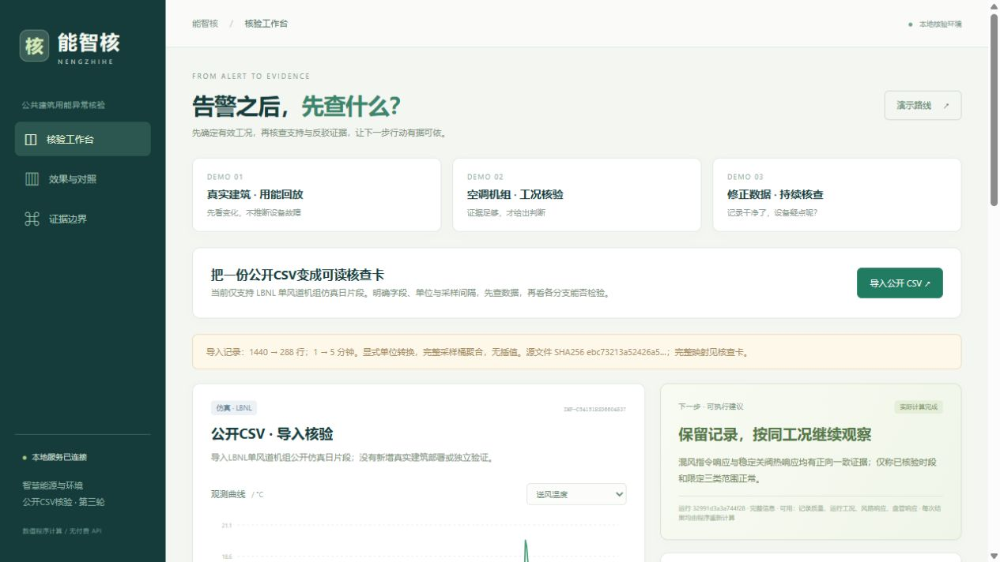

# 能智核 · 公共建筑用能异常核验

**告警之后，先查什么？** 面向公共建筑用能管理人员的核验工作台：检查数据质量，查看当前工况能否检验设备疑点，再给出有证据支持的判断与补证动作。参赛方向为「智慧能源与环境」。

**当前版本：[第三轮工作台](round3/README.txt)。阶段评审从 [评审索引](docs/REVIEW_INDEX.md) 开始。** 本仓库保留三轮源代码、冻结输入、逐例结果、审核反例及参赛底稿；历史轮次不覆盖。



## 本阶段已交付

- 三个可操作案例：BDG2 实测用能回放、LBNL 单风道空调机组仿真核验、修正重复记录后继续核查设备疑点。
- 公开原始 CSV → 字段、单位与采样间隔映射 → 真实重算 → 可阅读 HTML 核查卡；明确拒绝超出当前支持范围的输入。
- 数据质量与设备判断独立展示；同一个质量对象贯穿服务、诊断、界面与导出；实际采样间隔不匹配时拒判。
- [三份可编辑 Word](round3/materials/final)、[逐页视觉复检](round3/materials/QA_视觉复检.txt)及最终 PDF/页面预览。它们是匿名底稿，尚须确认身份填报与成熟度等行政字段。

## 快速运行当前版本

需要 Python 3.12（已验证版本 3.12.14）。无需模型、付费 API 或年度原始数据包。

```powershell
git clone https://github.com/tingfengy2000-creator/nengzhihe.git
cd nengzhihe
python -m venv .venv
.\.venv\Scripts\python.exe -m pip install -r round3/requirements.txt
cd round3
..\.venv\Scripts\python.exe -X utf8 server.py --port 18193
```

在浏览器打开 <http://127.0.0.1:18193/?demo=3>。当前终端按 Ctrl+C 停止。Windows 后台启动与仅停止本项目的命令见 [第三轮运行说明](round3/README.txt)。私有仓库克隆需要你的 GitHub 账号具有访问权限。

原始 CSV 演示文件：[LBNL_SDAHU_2018-04-10_raw_excerpt.csv](round3/data/public_csv/LBNL_SDAHU_2018-04-10_raw_excerpt.csv)。点击“导入公开CSV”，选择该文件、`Datetime`、1 分钟采样，按界面映射并确认当前仿真配置。完整步骤见 [导入任务说明](docs/DEMO.md)。

## 已有证据与边界

| 核查内容 | 可复查结果 | 应如何理解 |
| --- | --- | --- |
| 可靠性反例与输入契约 | 29 项检查通过 | 软件契约检查，不是故障诊断准确率 |
| 独立目录启动与 HTTP 全流程 | 11 项检查通过 | 当前依赖环境下的自包含性检查 |
| 历史 112 条记录回归 | 第三轮预测与第二轮一致，24 正确、88 未决 | 56 个基础日工况、14 个日期，同一仿真系统；现均为回归数据 |
| 025 / 075 风阀设置 | 基础日工况分别为 1/14、11/14 正确 | 保留差异，不包装为普适识别能力 |
| 正常 / 盘管阀泄漏 | 两组各 0/14 正确 | 112 条均没有合格盘管核验窗口，不能把未检测到视为排除故障 |

第二轮自身工程修复对照为 **6/112 → 24/112（5.36% → 21.43%，+16.07 个百分点）**，新增 20 条正确，同时 2 条原正确变为未决。第三轮修复可靠性与操作完整性，**没有新增性能提升主张**。主动查询尚未证明优于规则；未验证真实楼宇故障定位、人工效率提升或节能收益。BDG2 实测回放与 LBNL 仿真诊断分开呈现。

## 仓库结构

```text
.
├── round3/                 当前可独立启动的第三轮版本
│   ├── *.py、web/          服务、诊断、导入、导出与界面
│   ├── data/               演示、公开 CSV、历史回归输入与来源
│   ├── scripts/            启停、测试、复现及材料构建脚本
│   ├── output/             冻结核查结果、回归明细与界面截图
│   ├── materials/          三份 Word、赛事模板、逐页渲染与 QA
│   └── delivery/           第三轮评审 ZIP 与哈希清单
├── round2/                 第二轮源码、输入、逐例结果与交付包
├── data/、web/、*.py       首轮原始源码与已结束实验输入
├── output/、materials/     首轮结果与历史材料
├── delivery/               首轮评审包
├── runtime/                首轮模型下载脚本、元数据与许可
├── docs/                   阶段评审索引、更新约定及来源说明
├── tools/                  仓库检查和隔离复现入口
└── .github/                持续集成与评审问题模板
```

首轮原说明完整保留在 [docs/archive/round1_README.md](docs/archive/round1_README.md)。沿用既有轮次路径，保证相对路径、冻结清单和历史复现脚本仍可对应。根目录的旧 `server.py` 属于首轮；新演示请运行 `round3/server.py`。

## 复核与更新

在仓库根目录执行：

```powershell
python tools/check_repository.py
python tools/verify_round3.py
```

检查只在忽略的 `.review-work/` 内创建隔离副本，保留历史结果原件并输出新回执，不清理本地缓存。GitHub Actions 在每次推送及 Pull Request 中执行同一核查。

每次完成修改后：补充 [CHANGELOG](CHANGELOG.md)，执行检查，审阅变更，提交并推送 `main`。每个评审阶段建立固定标签与 Release；历史评审引用标签或 commit，不仅引用会变化的 `main`。详见 [CONTRIBUTING](CONTRIBUTING.md)。

公开数据、第三方许可及未上传的大文件见 [DATA_AND_LICENSES](docs/DATA_AND_LICENSES.md)。代码尚未授予开源许可；建立私有评审仓库不等于公开发布或授予第三方使用许可。
