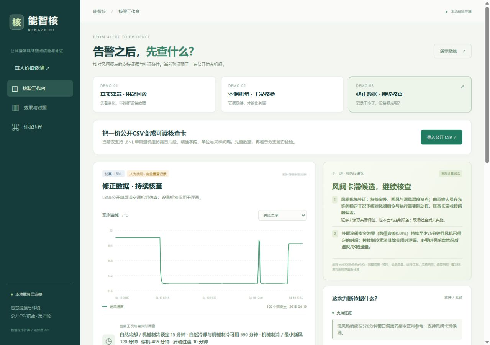

# 能智核——公共建筑风阀疑点核验与补证工作台

**告警之后，先查什么？** 核对数据质量，检查当前工况是否可检验，再把支持证据、限制与补证动作交给下一位核查人员。参赛方向：智慧能源与环境。

当前版本为 **round4**。先看 [固定版本评审入口](https://github.com/tingfengy2000-creator/nengzhihe/releases/tag/round4-review-v1)，下载 `nengzhihe_round4_review.zip` 后双击 `review/index.html`，无需安装即可查看三分钟实际操作视频、10页答辩PDF、三份材料及真实核查卡。私有仓库需被授予访问权限。



## 当前交付

- 公开原始CSV → 字段、单位、时间映射 → 真实核验 → 可溯源HTML核查卡；错误单位和采样间隔拒判。
- 数据质量与设备判断两个独立维度。重复记录修正后设备疑点仍可保留；改变证据会真实重算。
- 三个保留演示：BDG2实测回放、LBNL仿真核验、修正数据后继续核查。两套数据不拼接成真实故障证据。
- 可运行真人邀测包：常规曲线/表格与工作台，相同清单，8个匹配不同任务，4种交叉平衡顺序。**当前0人，待独立复核与招募；未验证提效。**
- [三份可编辑DOCX及PDF](round4/materials/final)共11页、[PPTX及PDF](round4/presentation/final)10页，均逐页视觉复检；[三分钟视频](round4/video/final/nengzhihe_actual_operation_3min.mp4)来自实际操作。

## 运行与复现

Python 3.12；无需模型或付费API。仅支持已验证LBNL单风道机组仿真配置。

```powershell
python -m pip install -r round4/requirements.txt
python -X utf8 round4/server.py --port 18195
```

打开 <http://127.0.0.1:18195>。邀测服务另运行 `python -X utf8 round4/study_server.py --port 18196`，打开 <http://127.0.0.1:18196>；正式入口未完成独立复核会保持锁定。只绑定本机。

详细步骤见 [当前说明](round4/README.txt)、[导入演示](docs/DEMO.md)、[邀测主持说明](round4/study/README.txt)。参考答案只给主持与评分人员，勿将整个源码包发给参与者。

```powershell
python tools/check_repository.py
python tools/verify_round4.py
```

复现创建保留的独立副本，不覆盖原成绩。GitHub Actions同时核查round3与round4。

## 已有结果与边界

主分母为 **56个基础日工况**：14个日期、2个日期块、1套仿真系统。112条另作原始/重复记录配对扰动回归，全部已属于历史资料。

| 源工况设置 | 基础数 | 当前工作台一致候选 | 未决 |
| --- | ---: | ---: | ---: |
| 正常 | 14 | 0 | 14 |
| 卡滞开度25%（025） | 14 | 1 | 13 |
| 卡滞开度75%（075） | 14 | 11 | 3 |
| 盘管阀泄漏 | 14 | 0 | 14 |
| 合计 | 56 | 12 | 44 |

固定温差阈值与去连续窗口约束消融也是同一12个候选，**没有新增性能优势**。025/075不等于故障轻重；正常和泄漏三分类召回仍为0。盘管没有合格窗口，不能把没有检测到当作设备正常。112条配对记录三方法各0组候选标签变化；这不支持“零误报”主张。本轮无新留出成绩。

29项可靠性、13项独立HTTP、21项邀测软件机制检查通过；336条方法—记录隔离复现一致。这些是软件与回归证据，不是人工提效、真实楼宇能力或节能收益。见 [阶段报告](round4/REPORT.txt)和[逐例对照](round4/output/comparison)。

## 仓库结构

```text
round4/                  当前阶段
  *.py, web/             核验、导入、导出、服务与界面
  data/, scripts/        公开输入、冻结回归数据与复现
  study/                 邀测协议、任务、未签署参考、评分与前端
  output/                对照结果、软件检查与真实截图
  materials/             官方模板、DOCX/PDF、逐页QA
  presentation/, video/  可编辑答辩稿、实际录制与来源
  delivery/              无需安装入口、评审包与运行包
round3/, round2/         历史源码、成绩与交付原件
根目录data/, web/, *.py  首轮历史源码与输入
 docs/, tools/, .github/ 评审索引、隔离复现、持续集成
```

根目录旧server.py属首轮；当前运行round4/server.py。历史 [round3说明](docs/archive/round3_README.md)、[首轮说明](docs/archive/round1_README.md)和[阶段评审索引](docs/REVIEW_INDEX.md)保留。

每次更新按 [CONTRIBUTING](CONTRIBUTING.md)执行检查、提交、推送与版本发布。私人导入、安装文件与缓存不入库，保留本机。来源与许可见 [数据说明](docs/DATA_AND_LICENSES.md)。身份字段留空，成熟度自评第3级；材料已视觉复检不等于报名手续完成。
