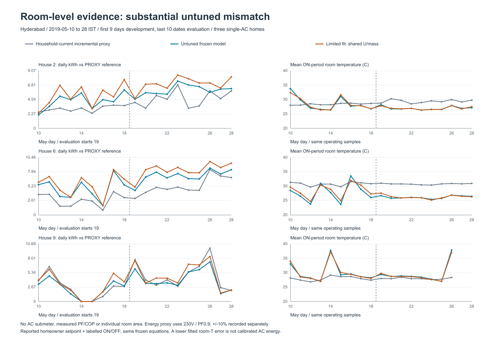
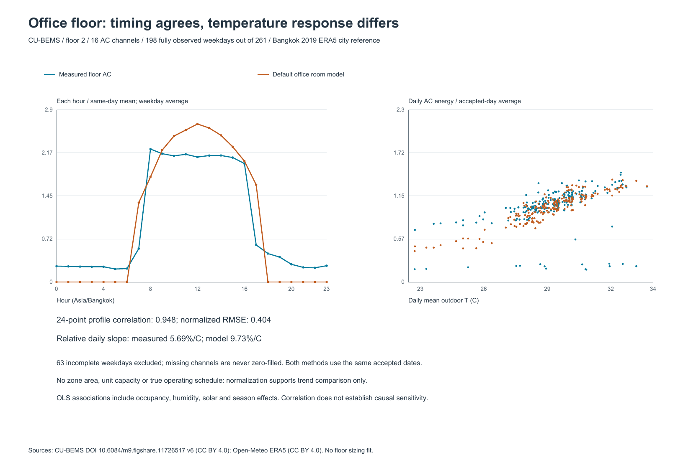
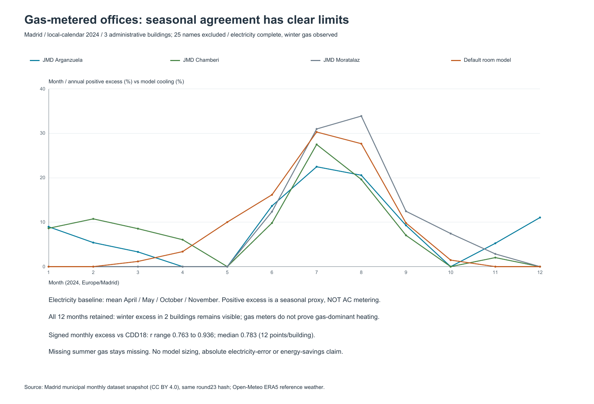

# 公开数据三层验证：趋势部分相符，校准尚未成立

按 `feat/5060-product-ui@7db47e3` 第24节执行，证据基于5090本机实际下载与模型运行。
产品源代码、API、前端、旧回放和前三层旧成绩均未修改。本目录是独立分析，不是产品新增地区入口。

## 三层结论与一张图

**房间级：未调参偏差明显，电量真值仍不足。** 数据集v3为CC0，CSV确认2019年5月10—28日；论文摘要2019与正文2021有冲突，以记录为准。按“单台、非变频分体、元数据齐、时间轴无重复倒序”选择前3户：2、6、9；3和8的室温时序异常不静默修补。没有任何一户具备完整的逐房间物理参数：面积只有论文卧室平均20㎡，建筑总面积不是卧室面积；缺现场电压、PF、COP、SHR及效率曲线。记录的是家庭进线相位电流，不是空调分表。电量只能用开发日OFF电流中位数作基线，从ON时段同相电流估计增量，假设230V、PF0.9，并保存±10%换算敏感性。后10天（5月19—28）未调参NMBE为+30.82%/+37.38%/−15.26%，CV(RMSE)为40.40%/39.30%/23.86%；运行时段室温RMSE为3.80/5.94/2.90℃。前9天只选择一组共享U/有效热容（6种固定组合），选中1.5 W/(㎡·K)/200 kJ/(㎡·K)，后段室温RMSE为3.30/5.09/2.26℃，但前两户电量代理CV(RMSE)变大到58.22%/59.98%，第三户降为19.70%。这不是空调分表校准，也没有证明总体精度改善。真实用户更改设定点、房间实际面积、人员及压缩机循环未知，当前证据不能把误差全归于单一模型参数。



**楼宇级：日内形状相符，温度响应偏高。** CU-BEMS采用2019年二层16路空调，只纳入各路1440分钟都有效的198个工作日；261个工作日剔除63个，不补零。各日24个小时÷同日平均小时电量后再求平均，模型和实测曲线相关r=0.9479、归一化RMSE=0.4042。相同日期逐日用电对日均外温OLS斜率÷平均日电量，实测5.69%/℃、模型9.73%/℃，后者约高71%。使用未改动的默认35㎡办公房间，只消除规模、不匹配楼层设备和运行时间；夜间基荷、节假日/人员、湿度和日照均可能影响结果。只能验证趋势及差异，不能声称完整办公楼精准负荷或因果温度系数。



**城市级：三个电/气范围明确的行政建筑，季节规律有限相符。** 马德里2024年28个行政建筑名称中纳入Arganzuela、Chamberí、Moratalaz三个，剔除25个，原因逐栋保留。电表必须同一明确总表且12个月完整；燃气用于筛选，需要1/2/12月有效且有冬季用气。初版“全年燃气也完整”筛选为0，因此在任何季节结果计算前改为冬季观测条件；缺测夏季燃气保留缺测。燃气表存在不能证明供暖主要依赖燃气。4/5/10/11月平均月电量为基线，夏季月差值是包含其他季节性负荷的代理。图保留全年12个月正超额占比，计算相关性时保留负增量，不删冬季异常。增量与CDD18（12点/栋）r=0.7633—0.9363，中位0.7830；三栋夏季占全年正超额56.7%—77.2%，默认房间模型夏季制冷占比74.1%。两个建筑仍有冬季正超额，不把它当制冷。只支持有限季节分布与温度关联，不是精确空调用电或收益验证。



[一页《公开数据验证》PDF](../../operation_planning/results/round24_public_validation/figures/公开数据验证.pdf)；三张独立PDF与PNG位于同一figures目录，均已渲染逐页复检。

## 输入、许可和时间口径

| 来源 | 实际快照与许可 | 使用范围 |
| --- | --- | --- |
| [印度住宅数据](https://doi.org/10.6084/m9.figshare.16869439.v3)，Tejaswini等 | v3，CC0；ZIP 1,802,819字节，发布方MD5一致；论文：[Energy Informatics 2022](https://link.springer.com/article/10.1186/s42162-022-00225-4) | 3个匿名户号的主空调相位电流和室温；不再发布收入、住址等无关家庭字段 |
| [CU-BEMS](https://doi.org/10.6084/m9.figshare.11726517)，Pipattanasomporn等 | v6，CC BY 4.0；复用round23的2019Floor2.csv字节及哈希；[原论文](https://www.nature.com/articles/s41597-020-00582-3) | 真实办公楼二层16路空调，不代表整栋楼；只比形状和关联 |
| [马德里市政府数据](https://datos.gob.es/en/catalogo/l01280796-consumo-de-energia-en-edificios-municipales-datos-mensuales)，Ayuntamiento de Madrid | CC BY 4.0；复用round23月表/字典快照，哈希不变 | 2024年相同12个月；行政类，电总表和冬季气表范围明确 |
| [Open-Meteo历史天气](https://open-meteo.com/en/docs/historical-weather-api)，ERA5/ECMWF/Copernicus | CC BY 4.0；明确请求`models=era5`，响应没有另给模型标识，不把平台默认混合模型叫ERA5 | 三个城市参考网格再分析，不是现场天气站或屋顶微气候 |

数据源/边界、请求参数、许可、发布方MD5、每份文件SHA256见`source_manifest.json`。本次raw ZIP/CSV和完整模型响应仍在ignored `working/`，不入库，不下载其他楼层/所有城市，不制作额外最小包。

温度/RH/气压用原定义的瞬时值；房间一分钟计算时线性插值。GHI右标记的前一小时平均转换为明确物理区间，在区间内恒定。真实次日边界提供末小时，不复制、不循环、不补0。印度时区Asia/Kolkata；CU为Asia/Bangkok；马德里UTC取原始天气后转换Europe/Madrid，2024年8784个真实小时、夏令时两个01/02时钟偏移都保留。室温模拟行是区间末状态，只与相同实际时刻观测匹配；排除初始化首小时，使用其前一分钟的运行标签。19天电量完整，不把19天称全年校准。

## 冻结与有限开发

`protocol.json`在模型运行前提交。选择只用类型、字段和时序质量，不用拟合好坏；6个U/热容组合只跑5月10—18日，选一组全房间共享参数，然后冻结后评价5月19—28日。9/10天是同户日期划分，不能称跨建筑泛化。NMBE正号为模型高估代理；指标采用显式`n−1`描述约定，既没有完整真值，也没有正式校准的参数自由度、全年覆盖和独立验证条件，因此不判ASHRAE Guideline 14达标。23项检查验证数据与计算对账，不能当精度成绩。

冻结模型的默认控制器不是非变频压缩机循环模型。分析仅临时注入源额定冷量、标签日程及初始状态（作用域结束后恢复函数），没有改热湿公式或产品目录。默认室内人员、朝向、通风、热容等未知值逐项保留在`room_parameter_basis.json`，BEE星级没有被转换成实测COP。有限调参没有接入产品。

## 完整执行与复查

在仓库根目录、5090本机，用已有Python3.14（numpy2.5.3/pandas3.0.6/PsychroLib）执行：

```powershell
# 新克隆先补已有round23原始资料；既有缓存不重下载。
python -X utf8 analysis/round23_real_case/fetch_sources.py
python -X utf8 analysis/round24_three_level/fetch_sources.py
# 发布结果已存在时必须指定新目录，避免覆盖证据。
python -X utf8 analysis/round24_three_level/run_validation.py --output-dir working/round24/reproduce_001
python -X utf8 analysis/round24_three_level/verify_outputs.py --output-dir working/round24/reproduce_001
```

不需要启动LLM、GPU推理、产品服务器或任何外部付费API；所有数值执行在5090主机，GPU命令输出保存用于环境取证，计算主体是CPU，并不声称GPU加速。新复跑只保存在ignored目录，不覆盖已发布结果。模型完整输出约百MB只保存哈希和相对路径；必要逐日、运行室温配对和逐月证据入库。

图表使用已安装的Codex bundled Python3.12/ReportLab；`render_figures.py`生成三张PDF，Poppler `pdftoppm -png -singlefile -scale-to 1650`生成同名PNG，再用`render_figures.py --summary`生成中文一页PDF并渲染。没有安装新绘图库。`public_validation.ipynb`是读取已生成结果的执行型伴随笔记本，原始计算路径在独立Python脚本中。

## 交付索引与版本

- 数值实际运行源码：`8e1d664758025c971185e21872e39d995c2e610b`；冻结产品来源`e7f0cf1d0eed5464835897c1d51db84040cb16a0`，全部顶层产品`.py`字节哈希不变。
- `run_manifest_all.json`：5090 GPU实际查询、Python/依赖、输入哈希、起止、命令、工作区状态、逐文件结果SHA256和完整响应哈希。
- `room_untuned_summary.json`先于有限调参；`room_limited_fit_freeze.json`含6个开发分数；`room_summary.json`含前后及±10%逐户数值；逐日表和室温配对可追溯。
- `cu_daily_quality.csv`含全部365天纳入/剔除；`cu_complete_weekdays.csv`为198个共同日期；`cu_normalized_weekday_profile.csv`为24点图源。
- `madrid_building_selection.json`含28个名称的准入及原因；`madrid_building_months.csv`为3×12月图源；`madrid_building_statistics.csv`保留逐栋相关系数，缺测气值为空，不是0。
- `attempts/`保留分析实现预检失败、时间轴对齐修正、严格气表条件导致0纳入的记录，不隐去失败。没有产品修复或方法无限调参。
- `delivery_manifest.json`补充图表/笔记本/视觉复检文件哈希，证据提交单独保存；不追求让提交自含自身SHA。

可写入答辩的表述是“完成三级公开数据对照、揭示默认情景模型的偏差与适用边界”；不能写“房间已校准”“全楼现场精准预测”“证明节能回本”。最需要的下一份证据是同一房间的独立空调有功电表、真实房间尺寸和厂家效率/控制设置，优先解决房间级绝对量问题。
