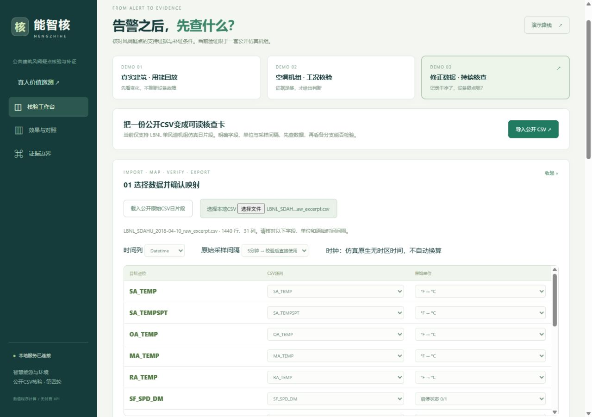
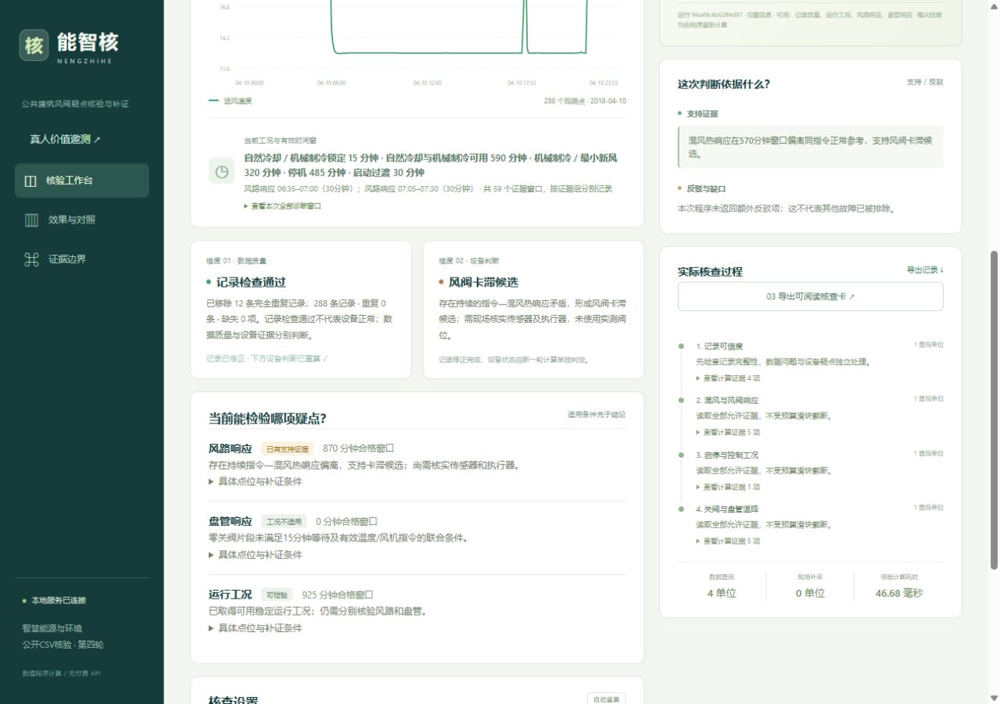

# 公开 CSV 到核查卡

启动第四轮后打开 <http://127.0.0.1:18195>。只支持当前 LBNL SDAHU 公开仿真配置，不是通用楼宇接入平台。

1. 点击“导入公开CSV”，选择 `round4/data/public_csv/LBNL_SDAHU_2018-04-10_raw_excerpt.csv`。
2. 时间列 `Datetime`，原始采样间隔 **1 分钟**。温度单位 `degF`，两个 `*_SPD_DM` 为 `binary`，其余控制指令为 `fraction`；17 类允许点位按同名列映射。
3. 确认当前仿真配置并核验。1440 行实际一分钟记录显式转为 288 行五分钟记录；多余实际阀位等列不参与诊断。
4. 查看记录质量与风路/盘管核验条件这两个维度，查看支持证据、缺少的点位或需补充的运行时段。
5. 导出 HTML 核查卡或 JSON 计算记录。HTML 支持离线阅读与打印。
6. 故意把原始间隔改为 5 分钟应被拒绝；改变预算或可用证据应重新计算。

三个保留演示：`?demo=1` 是 BDG2 实测回放；`?demo=2` 是 LBNL 仿真核验；`?demo=3` 包含 12 条完全重复记录，修正后质量通过，但设备疑点仍存在。

输入要求：UTF-8 单日 CSV，2—3000 行、最多 80 列、不超过 8 MiB，只接受 1 或 5 分钟栅格。缺失值不插值补证；不接受真实位置反馈、故障标签作为诊断点位。用户须如实声明字段和单位，软件不能仅凭数值证明文件来源。详细契约见 [第四轮说明](../round4/README.txt)。

命令行：在 `round4/` 中运行 `python -X utf8 scripts/demo_import.py`。这是已有开发日期的功能演示，不计入新留出成绩。已生成的 [HTML 核查卡](../round4/delivery/review/import_card.html) 可下载后打开。

三分钟实际录制见 [MP4](../round4/video/final/nengzhihe_actual_operation_3min.mp4)。真人价值实验见 [主持说明](../round4/study/README.txt)，当前0人，独立复核未签署。
