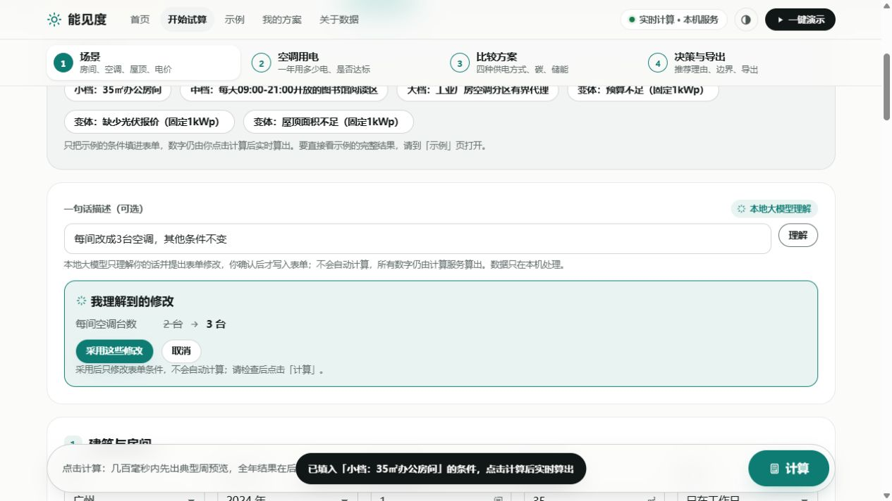
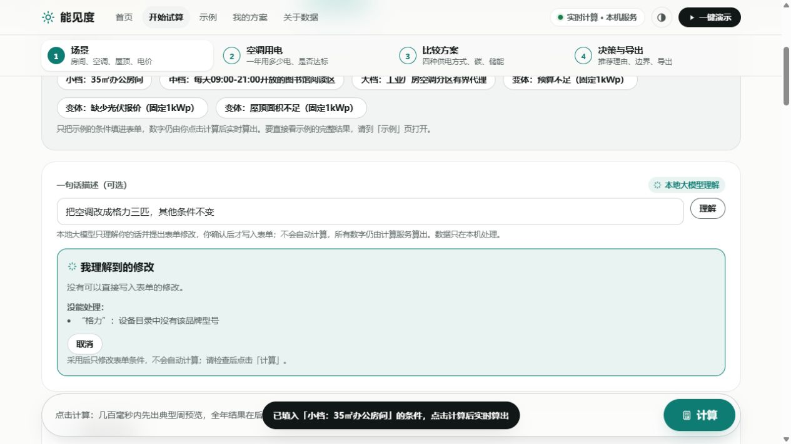
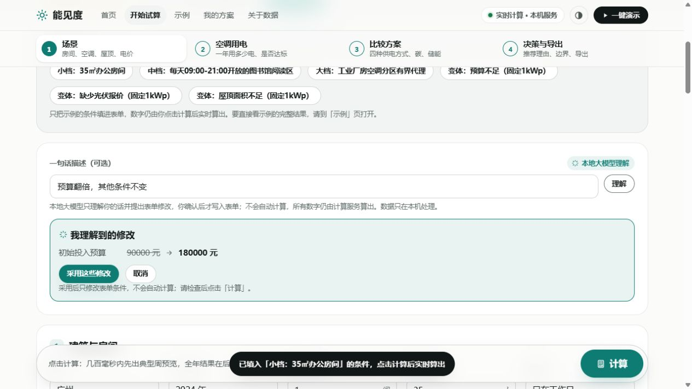
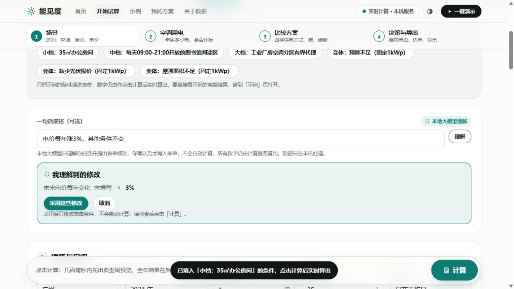
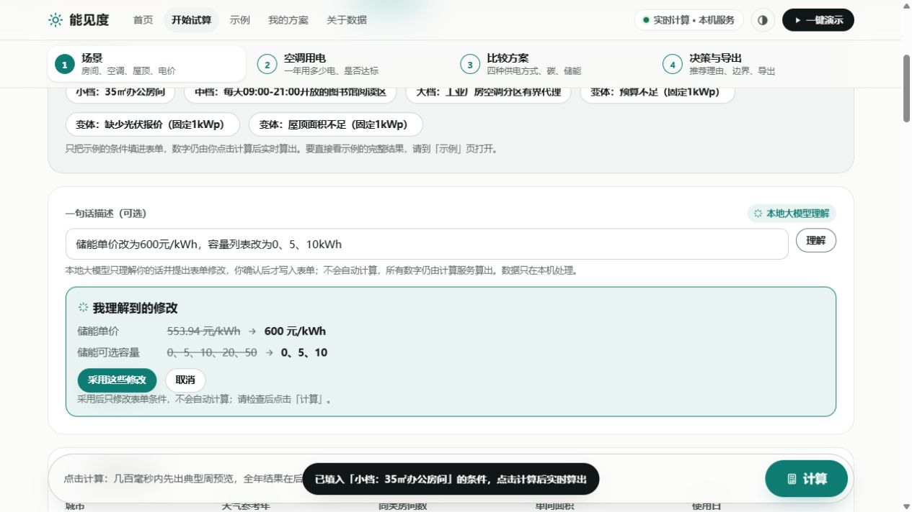

# 第21节：5090本机真模型与前端联调

2026-10-08晚至2026-10-09凌晨（Asia/Shanghai）。基线 `13c26feee1e8d5de3ed121cfe1cb44f317c9ea5c`，分支 `fix/5090-round21`。前端、需求原文和 frontend_redesign 目录没有修改。

## 环境与证据

- 实际 GPU 探测：NVIDIA GeForce RTX 5090，驱动610.88。Python 3.14；依赖版本、命令、输入输出哈希见 [run_manifest.json](../../../../../operation_planning/results/round21_local_5090/run_manifest.json)。
- 使用仓库原有 `nengzhihe-qwen3-4b-q4km` 本地模型，loopback端口18191，temperature=0，seed=20260930，max_tokens=512，关闭thinking；没有更换框架、权重或使用付费API。
- 浏览器实际打开18765工作台，逐句点击“理解→采用这些修改→计算”，不是直接API调用冒充浏览器测试。数据由原工作台和原数值引擎执行，取证服务只记录请求、原始模型返回和响应。
- [逐任务汇总](../../../../../operation_planning/results/round21_local_5090/task_records.json)含模型原始JSON、中文字段修改、表单前后值、提交任务、job_id、计算与证据行号。原始JSONL在同目录各轮子目录，长向量仅在审计副本用数量/哈希/首尾替代，浏览器实际得到完整响应；各次审计副本不等于完整逐时结果包。最终全年任务另存完整轮询响应final_economics/polled_complete_result.json，包含四方案逐时数据和全部附加路径。
- 初次源码a8c392b、参数修复0091dd8、单位保护4778096、最终费用修复d9fda1b分别记录。真实运行源码完整SHA在manifest；后续证据提交不冒充运行源码。所有尝试保存，最终表每句取最后一次；不是独立泛化或用户提效实验。

## 14种输入的实际记录

每句先载入小档条件：广州2024、1间35㎡、2台/间、工作日8–18、预算90000、PV候选0/1/2/5.6kWp、1台风机、35㎡屋顶、用户恒价0.66元/kWh、10年、完整示例报价。关闭卖电案例先把卖电勾选为是。每句相互独立，不将上一句改动叠加。

| 输入 | 模型/校验与修改清单 | 采用后与实际计算 | 理解HTTP / 全年可见时间 |
|---|---|---|---|
| 每间改成3台空调，其他条件不变 | 每间空调台数2→3 | room.units_per_room=3；588.744208 kWh/年，S0 | 0.313 / 5.193秒 |
| 把空调型号换成美的GAIA-12HRFN8 | MSAGBU型号→目录ID midea_gaia12 | 522.846536 kWh/年，S0 | 0.399 / 5.093秒 |
| 把空调改成格力三匹，其他条件不变 | 目录没有该品牌型号，unsupported | 不采用、不计算，不替换为其他型号 | 0.453秒 |
| 预算翻倍，其他条件不变 | 90000→180000元 | task预算180000；588.971245 kWh/年，S0 | 0.707 / 5.222秒 |
| 把使用时段改为18:00到22:00，其他条件不变 | 8→18点；18→22点 | 316.302508 kWh/年，S0 | 0.751 / 5.225秒 |
| 关闭余电卖给电网，其他条件不变 | 是→否 | allow_export=false；588.971245 kWh/年，S0 | 0.561 / 5.054秒 |
| 光伏改为2kWp，其他条件不变 | 模型返回2000；与原话单位不一致，failed | 修复后拒绝采用；旧版曾错误采用的记录保留 | 0.565秒 |
| 风机改为0台，其他条件不变 | 模型夹带room.equipment_id；failed | 不采用、不计算 | 0.285秒 |
| 电价每年涨3%，其他条件不变 | 未来电价每年变化→3% | HTTP任务为0.03；588.971245 kWh/年，S0 | 0.478 / 5.205秒 |
| 储能单价改为600元/kWh，容量列表改为0、5、10kWh | 553.94→600；列表→0、5、10 | 任务单价600、数组[0,5,10]；完成附加储能重算，S0 | 0.685 / 4.526秒 |
| 让储能按峰谷电价自动套利并保证回本 | 模型夹带allow_export；failed | 不采用、不计算；未宣称收益保证 | 0.891秒 |
| 预算调低一些 | needs_clarification：询问金额或比例 | 不采用、不计算；不再自行猜“减少一半” | 0.447秒 |
| 光伏装机设置为2千瓦，其他条件不变 | 光伏容量→2kWp | 实际任务容量2；588.971245 kWh/年，S0 | 0.674 / 2.934秒 |
| 风机数量设为零台，其他条件不变 | 仍夹带无关型号字段；failed | 失败保留，未重复优化模型 | 0.560秒 |

最后一次分布：8项采用并完成、1项透明unsupported、1项追问、4项failed。计算成功不等于投资获益；本组均在恒价/报价情景下推荐S0。两种光伏措辞和两种风机措辞都保留，不能挑选成功表达后报告“全部通过”。HTTP理解0.285–0.891秒；成功任务预览可见0.300–0.304秒，全年2.934–5.225秒。浏览器包含点击、响应传输和轮询，后端耗时另存，二者不混用。

## 初次缺陷与有限修复

1. `pv.capacity_kwp`已在schema内，却不在请求字段提示表，触发KeyError；补齐别名，不更换解析器。
2. 已等于当前值的明确输入不能因为“无变化”就要求追问；保留有效no-op。
3. 目录型号提示增加ID、品牌、展示型号，原本返回展示名造成的失败保留。
4. 模糊预算曾被模型擅自解释为乘0.5，增加拒绝猜数的保护。
5. 显式kWp/Wp输入校验模型提出的数值与单位，拒绝2kWp→2000kWp；没有用规则结果冒充模型成功。
6. 当前非零涨幅的敏感性表曾二次乘涨幅；改为先消除已存情景因子、再施加目标档位。主生命周期和物理轨迹不改。PV和Hybrid均增加非零当前档一致性契约。

## 模型关闭与恢复

核对PID9036为本项目llama-server后，实际停止该服务。刷新页面出现“规则识别 / 本地模型未启动”。输入“预算改为60000元，使用时段改为18点到22点，电价每年涨3%”：规则成功写入18、22与3%，计算得到316.302508 kWh/年，但预算仍90000。这是前端规则漏识别，已记录，不改前端。

补测规则已支持的写法“预算60000元，18点到22点，电价每年涨3%”，预算变60000。随后在同样条件切换自定义电价并计算。规则识别不计作模型成功。完成后恢复同一个原有模型服务，原日志已保留在ignored working目录。

## 第21.2的真实全年联动

最终源码d9fda1b，在浏览器手动输入用户自定义价格：谷0.31、平0.81、峰1.35、尖峰1.68。基准档案有效期2026-10-01至10-31，明确以current_tariff_on_reference_weather映射广州2024全年，8784条，不把它称历史2024账单。工作日18–22、预算60000、10年、涨幅3%。

- 预览可见0.494秒，全年可见8.090秒；后端真实计算7.260秒。
- 年负荷316.302507805 kWh，S0总成本4115.565531341元；风电超预算排除，剩余有限可计价方案条件性推荐S0。
- sensitivity包含−2%、0%、2%、3%、4%；3%唯一is_current=true，当前成本4115.565531341元，和候选逐位一致。修复前曾错误显示4751.990866589元。0%成本3590.028662656元。
- custom_tariff_echo完整回显四段输入和原生效期；没有按单月截断或报错。
- S0与实际不发电的退化候选不返回surplus_paths/storage_upper_bound；非零发电方案仍保留附加路径。卖电无接入投入文字为“无需额外投入”，缺价/无余电等状态有具体中文原因。
- [最终请求/响应审计](../../../../../operation_planning/results/round21_local_5090/final_economics/http_events.jsonl)与[页面原文](../../../../../operation_planning/results/round21_local_5090/final_economics/result_dom.txt)。

## 首页3D与打印

首页三维楼宇、光伏、风机可见，两次观察的时间标签从7月15日15:00推进到7月17日02:00；没有观察到冻结，浏览器捕获的warn/error为空。只作视觉观察，没有采集FPS，不据此宣称60FPS。[首页截图](home_3d.jpg)。

实际点击“决策简报”生成下载文件；点击“打印 / 另存为PDF”生成原生打印iframe，其HTML另存。IAB无法自动操作原生打印对话框，打印阻塞当前浏览器会话，关闭该临时标签后恢复；没有声称原生保存对话框已验收。使用本机Edge154将实际下载的HTML打印为PDF，未改CSS/正文；3页逐页渲染检查，中文/金额完整、无空白页或截字。四方案表跨第1/2页，第2页未重复表头；第3页尾部空余较大。此分页可阅读但仍有改善空间，前端只记录不改。

- [实际下载HTML](decision_brief_actual.html)、[渲染PDF](decision_brief_actual.pdf)、[实际打印iframe内容](print_iframe_actual.html)。三者对应的具体生成时间和任务在manifest记录；后一次自定义价打印与前一次恒价下载是两个任务，不混为同一个文件。
- 逐页PNG：print_page-1.png、print_page-2.png、print_page-3.png。

## 给5060的前端问题（本轮不修）

1. 解析failed也统一显示“模型暂不可用”，实际上模型在线且输出被校验拒绝，建议区分failed和unavailable。
2. 离线规则不识别“预算改为60000元”，却识别“预算60000元”；应显示未识别内容，避免用户以为全部采用。
3. “从小档示例开始”表单使用0.66恒价，而示例结果回放为官方档案；同名示例载入条件后再算会改变费用。数字来自真实文件/请求，未硬编码，但需统一示例输入口径。
4. 当前涨幅0/候选模式没有单一容量时，修改卡原值显示“未填写”；实际默认0/候选集合存在，应解释默认或模式。
5. PDF跨页表头与尾页留白；IAB原生打印对话框自动化限制另列，不推断所有浏览器都会冻结。

## 5张真模型截图

first_*.jpg保留早期尝试，不覆盖。最终结果截图final_result.jpg另存。

验收结论：第21.2四项后端接口修复及45项unittest、阶段二A/B专项回归通过；第21.1真机联调已执行并完整报告成功与失败。仍有上述前端体验问题和小模型稳定性缺口，不能称所有自然语言任务通过或现场精度已验证。
