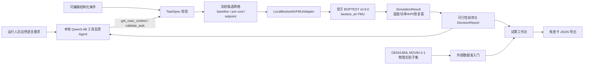

# 产品架构与可复查链路

Agent 只负责把用户语言转成工具选择和待校验条件。候选生成、时间窗、单位换算、温度带判定、功率积分、费用计算和排序均由程序完成。工具回路最多 8 轮；每轮记录动作、参数、结果摘要、错误和延迟，不记录思维链。

本地适配器在 Windows 调用 WSL 中的 FMPy，整段回放相同的历史和官方天气，候选之间只替换目标日期的控制输入。它不修改天气、内部得热或模型状态，也不把未来结果提前提供给在线顺序回放。公共 BOPTEST REST 接口另有标准客户端，但当前环境的 TLS 连接被关闭，状态在来源文件中留痕。

工作台的三页对应一个实际任务：运行要求 → 方案试算 → 结果与证据。每次改动约束都会创建新的 TaskSpec 并真实重新计算；无解时保留候选拒绝原因和需要调整的条件。当前产品适用范围是一个官方单房间办公单元，不包括 BMS 下发、供热优化、多楼层或现场节能承诺。

外部准入门只读取公开物理实验的时间戳、测量通道和控制指令来核验单位、采样与可用性；故障日历和 `Fault Detection Ground Truth` 不进入输入。由于该子集没有区温、能耗和实际执行器反馈，准入门明确返回“不能进行反事实方案评分”，不会把物理回放伪装成规划成绩。
